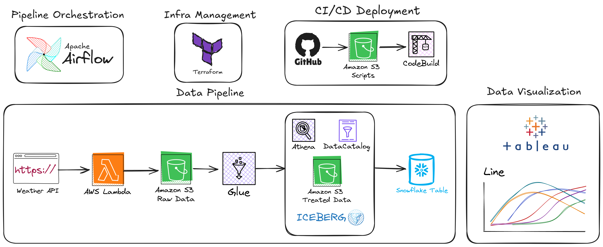
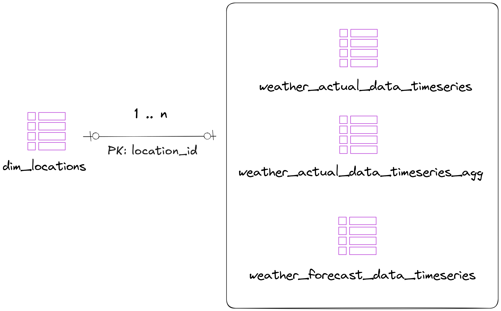
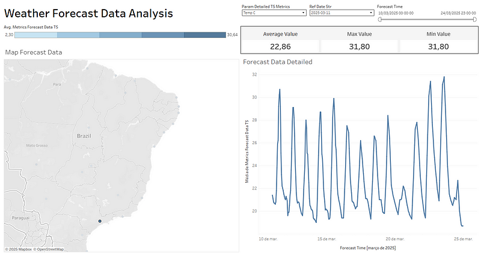

# Weather Data Pipeline

## Overview


This project implements a data pipeline to extract weather data using an external API, process it, and store it in an AWS-based data lake and warehouse system. The pipeline consists of tree main components:

1. **AWS Lambda Function:** Fetches weather data from the API and stores it in Amazon S3.
2. **AWS Glue Job:** Processes the raw weather data stored in S3 and loads it into a structured format using Apache Iceberg tables.
3. **Snowflake:** Serves as the final data warehouse, enabling efficient BI analysis and reporting.

For a detailed explanation, check out my Medium post: [Medium Article](https://medium.com/@claudiofilho22/end-to-end-data-engineering-project-using-aws-apache-iceberg-snowflake-90b76e7a1082)


## Project Folder Structure
```
├── airflow         # Folder with airflow components (docker yml, dags e etc)
├── datasets        # Datasets folder
├── glue            # Scripts and yml deployment of glue
├── lambda          # Scripts and yml deployment of lambda
├── snowflake       # Snowflake scripts
├── src             # Images, files utility for repo documentation
├── terraform       # Terraform configuration files
├── tableau_viz     # Folder with Tableau workbook files
```

### **Tables Created:**
| Table Name                          | Description                                                 |
|-------------------------------------|-------------------------------------------------------------|
| dim_locations                       | Stores metadata locations 
| weather_actual_data_timeseries      | Stores time-series weather data.                            |
| weather_actual_data_timeseries_agg  | Aggregates actual data by year,month,hour,location_id.      |
| weather_forecast_data_timeseries    | Stores time-series forecast data.                           |

### **Data Model:**


---

## Architecture
The pipeline follows this architecture:

1. **Apache Airflow:**
    - Orchestrate thhe pipeline

2. **Data Extraction (Lambda Function):**
    - Reads location data from S3.
    - Calls the weather API to fetch forecast or actual weather data.
    - Saves JSON data to S3 in the raw data folder.

3. **Data Processing (AWS Glue Job):**
    - Reads raw JSON files from S3.
    - Transforms and normalizes data using PySpark.
    - Creates Iceberg tables in AWS Glue Catalog.
    - Stores processed data in a structured warehouse.

4. **Snowflake:**
    - Connect apache iceberg tables from Glue Data Catalog into Snowflake.
    - Use the compute processing of snowflake to create analysis in Tableau.  

### **S3 Structure:**
```plaintext
s3://weather-datalake-projects/
  ├── pipeline-weather-data/
  │   ├── staging/
  │   │   ├── forecast_data/{location_id}.json
  │   │   ├── actual_data/{location_id}.json
  │   ├── warehouse/
  │   │   ├── warehouse_weather_data.db/
  │   │   │   ├── dim_locations/
  │   │   │   ├── weather_actual_data_timeseries/
  │   │   │   ├── weather_actual_data_timeseries_agg/ 
  │   │   │   ├── weather_forecast_data_timeseries/  
```
---

## AWS Lambda Function

### **Functionality:**
- Extracts weather data (forecast or actual) from the WeatherAPI.
- Stores the data as JSON in an S3 bucket.
- Supports a date range for historical data extraction.

---

## AWS Glue Job

### **Functionality:**
- Reads raw JSON data from S3.
- Converts it into Apache Iceberg tables.
- Performs time-series aggregation for analysis.

### **Data Processing Steps:**
1. Reads JSON data from S3 and converts it into a DataFrame.
2. Relationalizes the JSON into a structured format.
3. Processes time-series actual and forecast data.
4. Aggregates actual data by year, month, hour, location_id to generate insights with window functions.
5. Writes the structured data into Iceberg tables in Glue Data Catalog.


## Terraform Configuration

This project uses Terraform to manage infrastructure on AWS. Below is an overview of the main files and their purposes:

- **`provider.tf`**: Defines the AWS provider and general configurations.  
- **`variables.tf`**: Declares variables used throughout the infrastructure.  
- **`locals.tf`**: Defines local variables for reuse.  
- **`iam.tf`**: Configures IAM policies and permissions.  
- **`s3.tf`**: Provisions S3 buckets for storage.  
- **`glue.tf`**: Defines AWS Glue jobs and resources.  
- **`codebuild.tf`**: Configures AWS CodeBuild for automation CI/CD.  

### Usage

1. **Initialize Terraform**  
   ```sh
   terraform init
   ```
2. **Validate configuration**  
   ```sh
   terraform validate
   ```
3. **Plan infrastructure changes**  
   ```sh
   terraform plan
   ```
4. **Apply changes**  
   ```sh
   terraform apply
   ```

Optionally, to destroy resources:  
```sh
terraform destroy
```


## Apache Airflow Setup with Docker Compose

### Prerequisites
Ensure you have the following installed:
- [Docker](https://docs.docker.com/get-docker/)
- [Docker Compose](https://docs.docker.com/compose/install/)

### Installation Steps

1. **Go to the airflow folder to run your docker-compose**
   ```sh
   cd AWS/pipeline-weather-date/airflow
   ```

2. **Set the `AIRFLOW_UID` environment variable**
   Run the command below and place the output value in a `.env` file:
   ```sh
   echo -e "AIRFLOW_UID=$(id -u)" > .env
   ```

3. **Initialize Airflow** (only required for the first run)
   ```sh
   docker-compose up airflow-init
   ```

4. **Start Airflow**
   ```sh
   docker-compose up --build -d
   ```

## Stopping and Cleaning Up

To stop and remove all Airflow containers and volumes, run:
```sh
   docker-compose down
```

### Accessing the Airflow UI
Once Airflow is running, you can access the web interface at:
- **URL:** http://localhost:8080
- **Default Username:** `airflow`
- **Default Password:** `airflow`

### DAG
Below you can see the dag created by `airflow/dags/pipeline-weather-data.py` file:


### Tableau Visualization
The image below has an example of visualization created with the output data using Snowflake + Tableau:



## Author
Claudio César

[](https://www.linkedin.com/in/claudio-c%C3%A9sar-506961164/)
